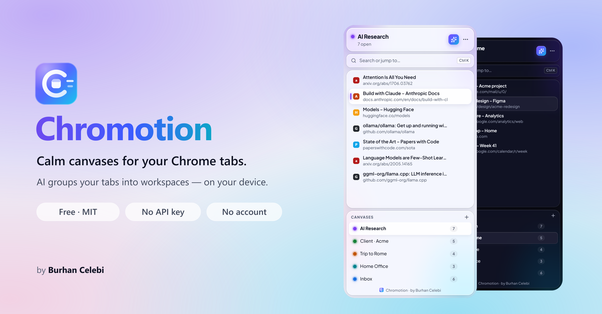
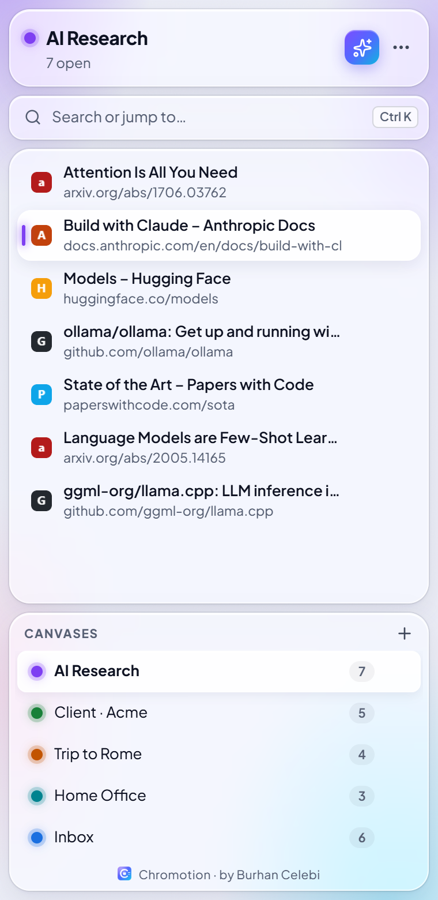
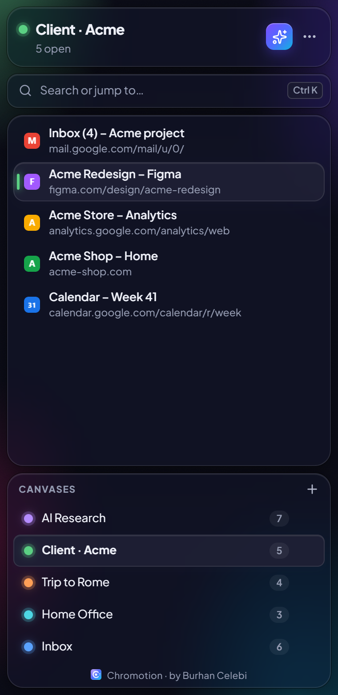
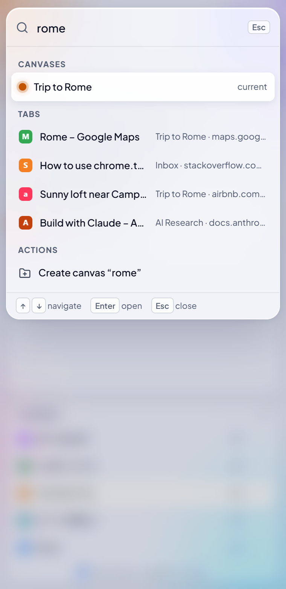
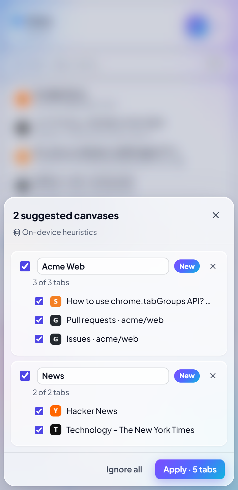
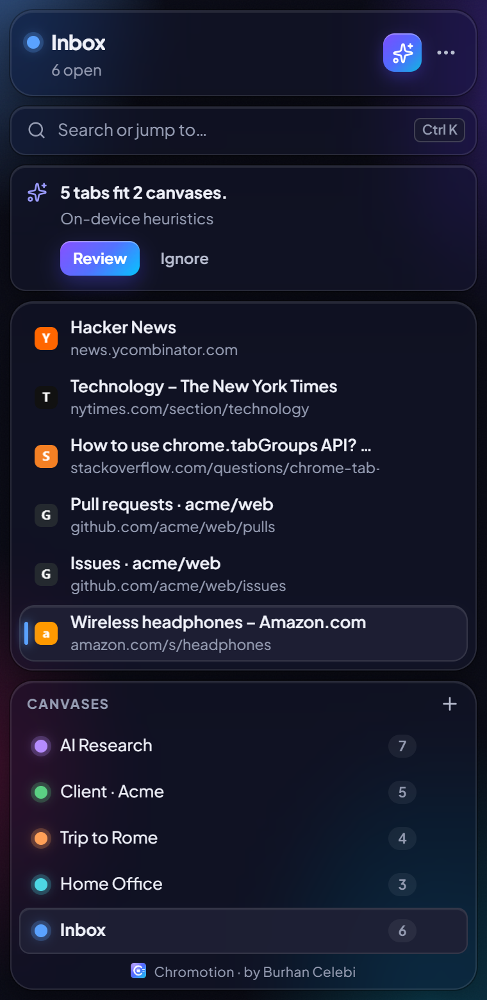
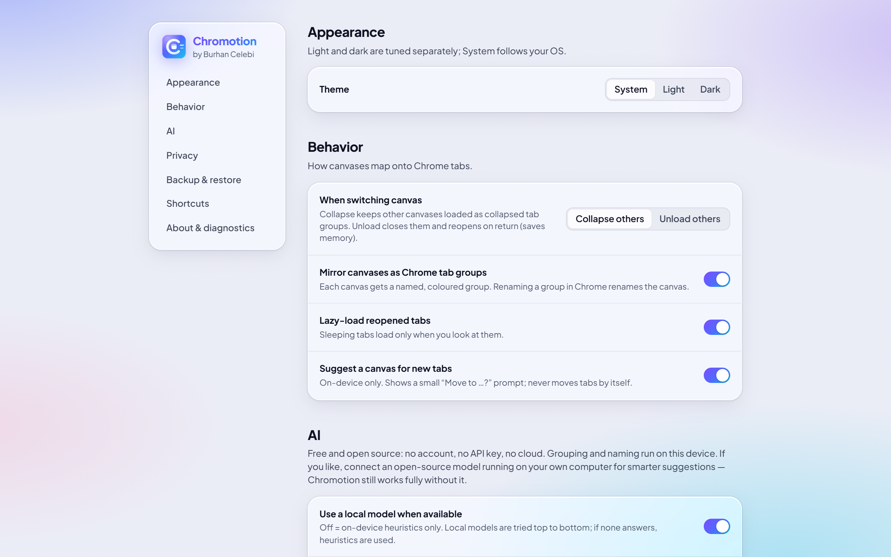

<p align="center">
  
</p>

<p align="center">
  <b>Free · Open source (MIT) · No account · No API key · Your tabs never leave your computer</b><br>
  <a href="../../releases/latest">Download</a> ·
  <a href="#install">Install</a> ·
  <a href="#türkçe">Türkçe</a>
</p>

---

**Chromotion** is a Chrome extension that turns tab chaos into calm **Canvases** — focused workspaces
like *AI Research*, *Client · Acme* or *Trip to Rome*. It lives in Chrome's side panel, groups related tabs
on your device, and lets you jump between contexts in a keystroke.

## Features

- **Canvases, not tab lists.** Each canvas is mirrored as a named, coloured Chrome tab group. Switch canvas and
  the others fold away (or unload to save memory).
- **AI grouping, on your device.** *Organize* suggests canvases from titles, sites, links and timing.
  Nothing moves until you confirm, and every action can be undone. Optionally connect a local open-source
  model (Ollama, LM Studio, llama.cpp). There is no cloud and no API key.
- **Keyboard first.** `Ctrl/⌘ K` command palette, `Alt 1…9` to switch canvas, full arrow-key navigation, `Ctrl/⌘ Z` undo.
- **Crash-safe.** Every change is journaled before it is acknowledged, so your canvases survive a browser
  restart, a service-worker restart or a crash. Automatic local snapshots are kept as well.
- **Fast with hundreds of tabs.** Virtualized lists, plus *sleeping tabs* that load only when you open them.
- **Portable backups.** Lossless JSON and human-readable CSV export/import.
- **Frosted-glass UI** with separately tuned light and dark themes. It respects reduced motion and reduced transparency.

## Screenshots

| Light | Dark | Command palette |
|---|---|---|
|  |  |  |

| AI suggestions (review before anything moves) | Suggestion banner |
|---|---|
|  |  |



## Install

1. Download **`chromotion-0.2.0.zip`** from [Releases](../../releases/latest) and **extract** it.
   You can also use the ready-built [`dist/`](dist) folder from this repository.
2. Open `chrome://extensions` and switch on **Developer mode**.
3. Click **Load unpacked** and select the folder that contains `manifest.json`.
4. Pin Chromotion from the puzzle menu and click it, or press `Alt+Shift+C`.

Chromotion works in Chrome 120+ and in Microsoft Edge (`edge://extensions`). The step-by-step guide with
troubleshooting is in [`scripts/KURULUM.txt`](scripts/KURULUM.txt) (TR/EN).

## Privacy

Chromotion has no server, no account, no analytics and no tracking. Canvases, tabs and backups stay in your
browser's local extension storage. Grouping runs on your device. If you connect a local model, it receives only
tab titles, hostnames and URL paths, and only over `localhost`. Chromotion never reads cookies, form fields or page content.
Details: [`docs/AI_PROVIDER_POLICY.md`](docs/AI_PROVIDER_POLICY.md).

## Development

```bash
npm install
npm run build        # → dist/
npm test             # unit tests (Vitest)
npm run e2e          # loads dist/ into Chromium (or Edge) and walks the full checklist
npm run release      # → release/chromotion-<version>.zip
npm run screenshots  # regenerates docs/screenshots
```

Stack: Manifest V3 · TypeScript · React · Vite · Chrome Side Panel. Read
[`docs/ARCHITECTURE.md`](docs/ARCHITECTURE.md) before contributing. The original product brief is in
[`docs/BUILD_KIT.md`](docs/BUILD_KIT.md). Issues and pull requests are welcome.

## License & author

[MIT](LICENSE) © 2026 **Burhan Celebi**, [drburhancelebi@icloud.com](mailto:drburhancelebi@icloud.com)

---

## Türkçe

**Chromotion**, Chrome sekme karmaşasını sakin **Canvas** çalışma alanlarına dönüştüren ücretsiz ve açık kaynak bir eklentidir.
Hesap ya da API anahtarı gerekmez, sekmeleriniz bilgisayarınızdan çıkmaz.

- Sekmeler, AI ile **cihaz üzerinde** gruplanır. Siz onaylamadan hiçbir şey taşınmaz ve her işlem geri alınabilir.
- `Ctrl+K` komut paleti, tam klavye kontrolü ve yüzlerce sekmede bile akıcı kullanım.
- Çökmeye dayanıklı kayıt sistemi, JSON/CSV yedekleme, açık/koyu buzlu cam tasarım.

**Kurulum:** [Releases](../../releases/latest) sayfasından zip'i indirip bir klasöre çıkarın. Ardından `chrome://extensions` →
**Geliştirici modu** → **Paketlenmemiş öğe yükle** → içinde `manifest.json` olan klasörü seçin.
Ayrıntılı rehber: [`scripts/KURULUM.txt`](scripts/KURULUM.txt).

Geliştiren: **Burhan Celebi**, drburhancelebi@icloud.com · Lisans: MIT
