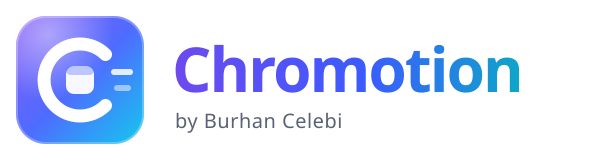

<p align="center"></p>

# Chromotion — AI Tab Canvas Chrome Extension

> **Ürün adı:** Chromotion (çalışma adı: TabCanvas)  
> **Geliştiren:** Burhan Celebi · drburhancelebi@icloud.com  
> **Lisans:** MIT — ücretsiz ve tamamen açık kaynak. Hesap ya da API anahtarı gerekmez.  
> **Amaç:** Açık Chrome sekmelerini AI destekli, kalıcı ve hızlı geçiş yapılabilen **Canvas** çalışma alanlarına ayıran premium Chrome Extension.

---

## 1. Ürün fikri

TabCanvas klasik bir “tab manager” değildir.

Temel model:

```text
Chrome
  └─ Canvas
      ├─ Tab
      ├─ Tab
      └─ Tab
```

Kullanıcı onlarca sekme açar. Sistem sekme başlığı, URL, domain, opener ilişkisi ve zaman yakınlığı gibi **minimum metadata** ile sekmeleri anlamlı çalışma alanlarına ayırmayı önerir.

Örnek:

```text
AI Research
├─ OpenAI Docs
├─ Anthropic Docs
├─ GitHub
└─ Research paper

Client A
├─ Gmail
├─ Figma
├─ Analytics
└─ Client website
```

Ana hedefler:

- sekme kalabalığını azaltmak,
- bağlamlar arasında saniyesiz denecek kadar hızlı geçiş yapmak,
- Chrome/servis worker crash'inde çalışma alanlarını kaybetmemek,
- AI kapalıyken bile ürünü kullanılabilir tutmak,
- kullanıcıyı karmaşık ayarlara boğmamak.

---

## 2. Tasarım standardı — UI/UX Pro Max zorunlu

Agent geliştirmeye başlamadan önce şu repository'yi kontrol etmelidir:

```text
https://github.com/nextlevelbuilder/ui-ux-pro-max-skill.git
```

Kurulum için repository'nin güncel README/CLI yönergeleri takip edilmelidir.

Yeni proje olduğu için UI/UX Pro Max'in **design-system** akışı çalıştırılmalı ve sonuç proje içine persist edilmelidir.

Önerilen yön:

```text
productivity chrome-extension spatial workspace glass translucent
```

Hedef tasarım dili:

- Apple esintili fakat Apple arayüzünü kopyalamayan,
- translucent / blurred,
- sakin,
- premium,
- bilgi yoğun fakat düşük bilişsel yüklü,
- klavye kullanımını birinci sınıf kabul eden,
- light/dark modda ayrı ayrı ayarlanmış,
- erişilebilir.

> “Glassmorphism template” görünümü yasak. Blur, gradient ve glow dekorasyon değil hiyerarşi için kullanılmalı.

UI/UX Pro Max çıktısı şu dosyada kalıcı tutulmalı:

```text
design-system/tabcanvas/MASTER.md
```

---

## 3. Ücretsiz AI politikası

> **Güncel karar (2026-10-07):** Chromotion ücretsiz dağıtılan, tamamen açık kaynak bir eklentidir; bulut AI ve API anahtarı
> kullanılmaz. Gruplama cihaz üzerinde yapılır, isteğe bağlı olarak kullanıcının kendi bilgisayarındaki açık kaynak bir
> modele (Ollama, LM Studio, llama.cpp…) bağlanılabilir. Aşağıdaki bölüm ilk kit metnidir; geçerli politika
> [`AI_PROVIDER_POLICY.md`](AI_PROVIDER_POLICY.md).

Agent AI sağlayıcısını ezbere seçmemelidir.

Her geliştirme / entegrasyon aşamasında şu repository kontrol edilmelidir:

```text
https://github.com/OuterSpacee/free-ai-apis.git
```

Bu repository bir API kataloğudur. Agent:

1. LLM / Text Generation bölümünü inceler.
2. Gerçekten ücretsiz katmanı olan ve o anda çalışır durumda görünen sağlayıcıları belirler.
3. Kredi kartı gerektirmeyen seçenekleri tercih eder.
4. Extension ortamında kullanılabilirliği, CORS, rate-limit ve auth modelini kontrol eder.
5. Tek sağlayıcıya hard-code olmaz.
6. Sağlayıcı başarısızsa sıradaki uygun sağlayıcıya geçer.
7. Hiç AI erişimi yoksa local heuristic grouping kullanır.

### Önerilen provider abstraction

```ts
interface AiGroupingProvider {
  id: string;
  isAvailable(): Promise<boolean>;

  clusterTabs(input: TabMetadata[]): Promise<CanvasSuggestion[]>;
  suggestCanvasForTab(
    tab: TabMetadata,
    canvases: CanvasSummary[]
  ): Promise<CanvasAssignmentSuggestion>;

  generateCanvasName(tabs: TabMetadata[]): Promise<string>;
}
```

### Provider seçim mantığı

```text
1. Kullanıcı tarafından yapılandırılmış çalışan ücretsiz provider
2. free-ai-apis listesindeki uygun ücretsiz provider
3. ikinci ücretsiz provider
4. local heuristic provider
```

Provider/model isimleri build sırasında sabit varsayılmamalıdır. Ücretsiz planlar değişebileceği için agent güncel dokümantasyonu doğrulamalıdır.

### Güvenlik

- API key source code'a yazılmaz.
- API key Git'e commit edilmez.
- Key local extension storage'da tutulacaksa açıkça belirtilir.
- Mümkün olan en az metadata gönderilir.
- Cookie, form içeriği, auth token, sayfa gövdesi varsayılan olarak gönderilmez.
- AI kapalıyken ürün temel fonksiyonlarını kaybetmez.

---

## 4. Chrome mimarisi

Tercih:

```text
Manifest V3
TypeScript
React
Vite
Chrome Side Panel
```

Ana yüzey:

```text
Side Panel
```

Toolbar icon:

```text
Side Panel aç/kapat
```

Opsiyonel küçük popup yalnızca hızlı aksiyonlar için kullanılabilir.

### Modüller

```text
src/
├─ background/
├─ sidepanel/
├─ popup/
├─ options/
├─ components/
├─ features/
│  ├─ canvases/
│  ├─ tabs/
│  ├─ ai/
│  ├─ search/
│  ├─ backup/
│  └─ recovery/
├─ storage/
├─ chrome/
├─ hooks/
├─ lib/
└─ types/
```

Chrome API çağrıları React component'lerinin her tarafına dağılmamalıdır.

Önerilen servisler:

```text
ChromeTabsAdapter
CanvasRepository
TabRepository
PersistenceService
RecoveryService
BackupService
AiGroupingService
AiGroupingProvider
```

---

## 5. Canvas veri modeli

Canvas minimum:

```ts
type Canvas = {
  id: string;
  name: string;
  icon?: string;
  accent?: string;

  createdAt: number;
  updatedAt: number;
  lastOpenedAt: number;

  order: number;
  pinned: boolean;
  archived: boolean;

  description?: string;
};
```

Tab minimum:

```ts
type StoredTab = {
  id: string;          // internal UUID
  chromeTabId?: number;
  windowId?: number;

  url: string;
  title: string;
  faviconUrl?: string;

  canvasId: string;
  position: number;

  pinned: boolean;
  active: boolean;

  createdAt: number;
  lastVisitedAt: number;
};
```

Chrome `tabId` restart sonrası kalıcı kimlik gibi kullanılmamalıdır.

---

## 6. Crash-safe persistence

Ana kaynak:

```text
chrome.storage.local ve/veya IndexedDB
```

State memory'de tutulabilir ama memory authoritative değildir.

Persist edilecek minimum root state:

```ts
type PersistedState = {
  schemaVersion: number;
  canvases: Canvas[];
  tabs: StoredTab[];
  lastActiveCanvasId?: string;
  preferences: Preferences;
  lastSnapshotAt: number;
};
```

### Event journal

Kritik değişiklikler append-style event journal ile desteklenmelidir:

```text
CANVAS_CREATED
CANVAS_RENAMED
CANVAS_DELETED
TAB_ASSIGNED
TAB_MOVED
TAB_REMOVED
CANVAS_SWITCHED
TAB_OPENED
TAB_CLOSED
```

Her event:

```text
id
timestamp
type
payload
```

Amaç: yarım kalmış write veya service-worker restart durumlarında state'i yeniden inşa edebilmek.

---

## 7. CSV + JSON backup

CSV **ana veri kaynağı değildir**.

Primary recovery browser storage'dır.

CSV:

- portable,
- okunabilir,
- export/import edilebilir,
- kullanıcı backup'ı olarak kullanılabilir.

Önerilen kolonlar:

```text
timestamp
canvas_id
canvas_name
tab_uuid
tab_title
tab_url
tab_position
tab_status
last_visited
```

Ayrıca lossless JSON backup önerilir.

```text
JSON = tam fidelity
CSV  = taşınabilir / kullanıcı okunabilir
```

Dosya sistemine sürekli yazma yalnızca kullanıcı açıkça bir destination seçtiğinde ve ortam güvenli biçimde izin verdiğinde opsiyonel olabilir.

---

## 8. Temel UX

Side panel:

```text
┌─────────────────────────────┐
│ AI Research           •••   │
│ 12 tabs                     │
├─────────────────────────────┤
│ 🔎 Search / Cmd+K           │
├─────────────────────────────┤
│ favicon  OpenAI Docs        │
│          platform.openai... │
│                             │
│ favicon  GitHub             │
│          github.com         │
│                             │
│ favicon  Research paper     │
│          arxiv.org          │
├─────────────────────────────┤
│ Canvases                    │
│ ● AI Research          12   │
│ ○ Client Work           8   │
│ ○ Shopping              4   │
└─────────────────────────────┘
```

Birincil interaction'lar:

- Canvas seç
- tab aç
- tab'i Canvas'a sürükle
- yeni Canvas oluştur
- AI ile grupla
- Cmd/Ctrl+K ile her şeyi ara
- Undo

---

## 9. AI davranışı

AI bir chatbot değildir.

Ana UI'da chat kutusu bulunmamalıdır.

AI:

- sekmeleri grupla,
- Canvas adı öner,
- kısa Canvas açıklaması üret,
- yeni tab için uygun Canvas öner.

Örnek:

```text
7 tabs look related.

Create “AI Research”?

[Create] [Review] [Ignore]
```

AI hiçbir zaman sessizce büyük miktarda sekmeyi dağıtmamalıdır.

Local heuristic fallback örnekleri:

- aynı domain,
- URL path benzerliği,
- title token benzerliği,
- opener ilişkisi,
- kısa zaman aralığında açılma,
- mevcut Canvas isimleriyle fuzzy match.

---

## 10. Klavye ve hız

`Cmd/Ctrl + K` command palette:

- Canvas ara
- Tab ara
- Create Canvas
- Move Current Tab
- Organize with AI
- Restore Workspace
- Open Settings

Arrow keys + Enter + Esc tamamen çalışmalıdır.

Normal arama AI çağrısı yapmamalıdır.

---

## 11. Performans hedefi

Akıcı kullanım:

```text
20 tabs
100 tabs
500 tabs
```

Gerekirse:

- virtualization,
- selector-based state subscriptions,
- memoized rows,
- debounce,
- background async processing.

AI hiçbir zaman UI thread'i bloklamamalıdır.

---

## 12. Privacy

Varsayılan veri minimizasyonu:

AI'ya gerekmedikçe gönderme:

```text
cookie           NO
form content     NO
auth token       NO
page body        NO
full history     NO
```

Tercihen gönder:

```text
tab title
hostname
URL'nin güvenli/uygun kısmı
mevcut Canvas isimleri
```

Settings içinde kullanıcının hangi metadata'nın cloud AI'ya gittiğini görebileceği açık bir açıklama bulunmalıdır.

---

## 13. MVP bitiş kriteri

Aşağıdakilerin tamamı çalışmadan MVP bitmiş sayılmaz:

- [ ] Extension kuruluyor
- [ ] mevcut tab'ler algılanıyor
- [ ] Canvas oluşturuluyor
- [ ] Canvas rename oluyor
- [ ] Canvas reorder oluyor
- [ ] Tab Canvas'a taşınıyor
- [ ] drag/drop çalışıyor
- [ ] AI grouping suggestion çalışıyor
- [ ] AI yokken local fallback çalışıyor
- [ ] Cmd/Ctrl+K çalışıyor
- [ ] restart sonrası state korunuyor
- [ ] service worker restart sonrası state korunuyor
- [ ] CSV export/import çalışıyor
- [ ] lossless JSON backup çalışıyor
- [ ] light/dark/system çalışıyor
- [ ] klavye navigasyonu tam
- [ ] 100+ tab'de UI kullanılabilir
- [ ] API failure ürünü bozmaz
- [ ] state otomatik persist edilir

---

## 14. Paketteki dosyalar

```text
README.md
prompts/MASTER_BUILD_PROMPT.md
docs/AI_PROVIDER_POLICY.md
docs/ARCHITECTURE.md
assets/logo.svg
assets/logo-mark.svg
assets/icons/icon16.png
assets/icons/icon32.png
assets/icons/icon48.png
assets/icons/icon128.png
assets/manifest-icons.json
```

---

## 15. Agent'a ne verilecek?

En kolayı:

1. Bu ZIP'i proje root'una aç.
2. Agent'a `prompts/MASTER_BUILD_PROMPT.md` dosyasını okut.
3. Ardından `README.md` dosyasını proje contract'ı olarak kabul etmesini söyle.
4. UI geliştirmeden önce UI/UX Pro Max'i kurup design system'i persist etmesini zorunlu tut.
5. AI entegrasyonundan önce `free-ai-apis` repo'sunu yeniden kontrol ettir.

---

## 16. Uygulama durumu (2026-10-07, v0.2.0)

### Kullanıcılar için kurulum

1. GitHub **Releases** sayfasındaki `chromotion-0.2.0.zip` dosyasını bir klasöre **çıkarın** (zip doğrudan yüklenemez).
2. `chrome://extensions` → **Geliştirici modu** → **Paketlenmemiş öğe yükle** → içinde `manifest.json` olan klasörü seçin.
3. Araç çubuğundaki Chromotion ikonu (veya `Alt+Shift+C`) yan paneli açar.

Ayrıntılar ve sorun giderme: zip içindeki `KURULUM.txt`. Bir bilgisayarda çalışmazsa: Ayarlar → **About & diagnostics** → *Copy report*.

### Geliştiriciler için

```bash
npm install
npm run release      # derle + release/chromotion-<sürüm>.zip
```

| Komut | Açıklama |
|---|---|
| `npm run dev` | İzleme modunda derleme (`dist/`) |
| `npm run typecheck` / `npm test` | TypeScript / birim testleri |
| `npm run e2e` | Derlenmiş uzantıyı Chromium'a (yoksa Edge'e) yükleyip uçtan uca dener |
| `npm run icons` | `assets/logo-mark.svg` → PNG ikonlar |
| `npm run package` | Mevcut `dist/`'ten paylaşılabilir zip |

### MVP kontrol listesi

Her madde `npm run e2e` ile gerçek bir Chromium'da doğrulandı (39/39 kontrol):

- [x] Extension kuruluyor
- [x] mevcut tab'ler algılanıyor
- [x] Canvas oluşturuluyor
- [x] Canvas rename oluyor (Chrome tab group adına da yansıyor)
- [x] Canvas reorder oluyor (sürükle-bırak ve `Alt+↑/↓`)
- [x] Tab Canvas'a taşınıyor
- [x] drag/drop çalışıyor
- [x] AI grouping suggestion çalışıyor (cihaz üzerinde; inceleme + onay, Undo'lu)
- [x] AI yokken local fallback çalışıyor
- [x] Cmd/Ctrl+K çalışıyor
- [x] restart sonrası state korunuyor
- [x] service worker restart sonrası state korunuyor (journal replay)
- [x] CSV export/import çalışıyor
- [x] lossless JSON backup çalışıyor
- [x] light/dark/system çalışıyor
- [x] klavye navigasyonu tam
- [x] 100+ tab'de UI kullanılabilir
- [x] API failure ürünü bozmaz (yerel model kapalı/izinsiz → heuristic)
- [x] state otomatik persist edilir

### Kapsam notları

- Popup yok: ikon tıklaması doğrudan yan paneli açar.
- Dosya sistemine sürekli yazma (opsiyonel, §7) yapılmadı; yedekler dosya olarak dışa aktarılır, yerel snapshot'lar otomatik alınır.
- Ayrıntılar: [`ARCHITECTURE.md`](ARCHITECTURE.md), [`AI_PROVIDER_POLICY.md`](AI_PROVIDER_POLICY.md).

---

Chromotion · by Burhan Celebi · drburhancelebi@icloud.com · [MIT](../LICENSE)
